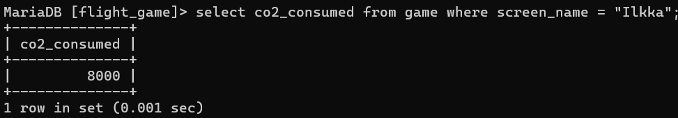

#Week 3

###assignment 1
select * from goal;

###assignment 2
select name from airport where iso_country = "FI";

###assignment 3
select name from airport where iso_country = "FI" order by name;

###assignment 4
select name, type from airport where iso_country = "FI" order by type, name;

###assignment 5
select name from country where name like "F%";

###assignment 6
select name from country where name like "%F%";

###assignment 7
select location from game where screen_name="Vesa";

###assignment 8
select co2_consumed from game where screen_name = "Ilkka";

###assignment 9
select distinct co2_budget from game;

###assignment 10
select screen_name, co2_budget, co2_consumed, (@co2_left:=co2_budget-co2_consumed) as co2_left from game where screen_name = "Ilkka";
