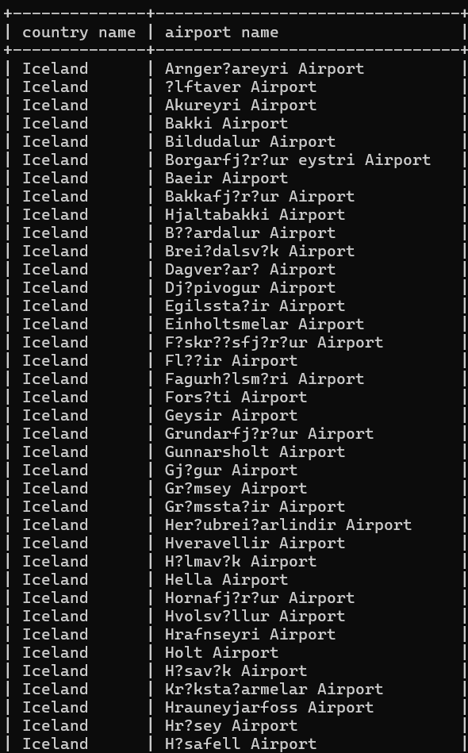
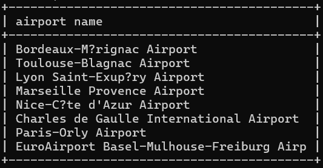
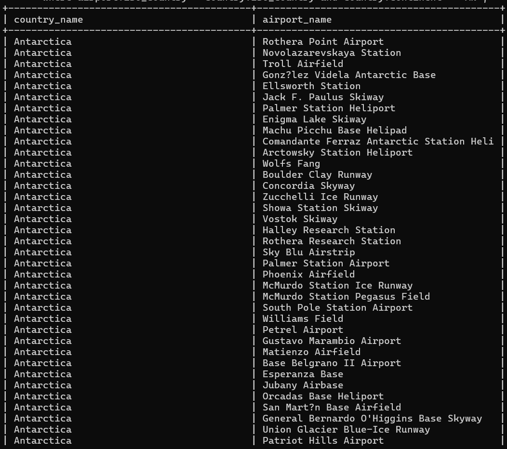
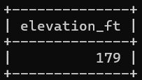
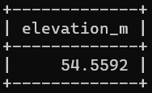
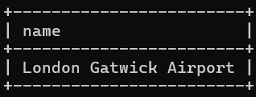
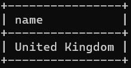
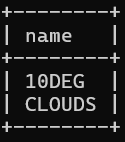
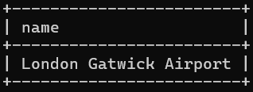
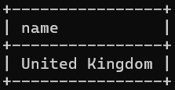

#week 3

###assignment 1
select country.name as "country name", airport.name as "airport name"
from airport, country
where airport.iso_country = country.iso_country and country.name = "Iceland";

###assignment 2
select airport.name as 'airport name' from airport,country
where airport.iso_country=country.iso_country and country.name ='France' and airport.type='large_airport'

###assignment 3
select country.name as country_name, airport.name as airport_name
from airport, country
where airport.iso_country = country.iso_country and country.continent = "AN";

###assignment 4
select elevation_ft
from airport, game
where location = ident and screen_name = "Heini";

###assignment 5
select 0.3048*elevation_ft as elevation_m 
from airport, game
where location = ident and screen_name = "Heini";

###assignment 6
select airport.name
from airport, game
where location = ident and screen_name = "Ilkka";

###assignment 7
select country.name
from airport, game, country
where location = ident and airport.iso_country = country.iso_country and screen_name = "Ilkka";

###assignment 8
select name
from goal, goal_reached, game
where game.id = game_id and goal.id = goal_id and screen_name = "Heini";

###assignment 9
select airport.name
from goal, goal_reached, game,airport
where game.id = game_id and goal.id = goal_id AND location = airport.ident and screen_name = "Ilkka";

###assignment 10
SELECT country.name                                                                                                                                
from goal, goal_reached, game,airport,country                                                                                                      
where game.id = game_id and goal.id = goal_id AND location = airport.ident AND airport.iso_country = country.iso_country and screen_name = "Ilkka";
