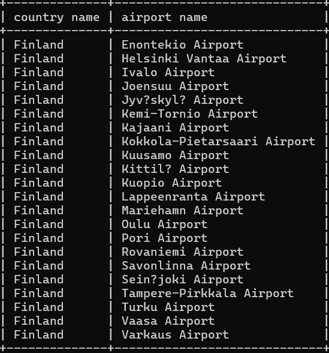
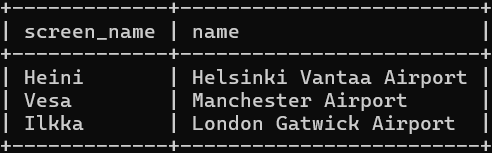
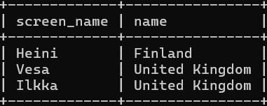
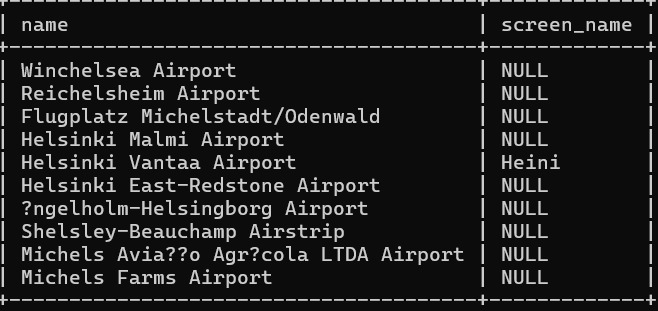
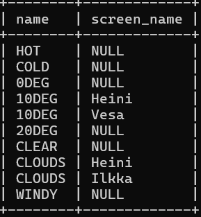

#week 4

###assignment 1
select country.name as "country name", airport.name as "airport name"
from country inner join airport on airport.iso_country = country.iso_country
where country.name = "Finland" and scheduled_service = "yes";

###assignment 2
select screen_name, airport.name
from game inner join airport on location = ident;

###assignment 3
select screen_name, country.name
from game inner join airport on location = ident inner join country on airport.iso_country = country.iso_country;

###assignment 4
select airport.name, screen_name
from airport left join game on ident = location where name like "%Hels%";

###assignment 5
select name, screen_name
from goal left join goal_reached on goal.id = goal_id  left join game on game.id = game_id;
