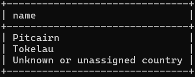

#week 4

###assignment 1
select name
from country
where iso_country in(
select iso_country
from airport
where name like "Satsuma%"
);

###assignment 2
select name
from airport
where iso_country in(
select iso_country
from country
where name = "Monaco");

###assignment 3
select screen_name
from game
where id in (
select game_id
from goal_reached
where goal_id in(
select id
from goal
where name = "CLOUDS"));

###assignment 4
select country.name
from country
where iso_country not in
(select airport.iso_country
from airport);

###assignment 5
select name
from goal
where id not in(
select goal.id
from goal, goal_reached, game
where game.id = game_id and goal.id = goal_id and screen_name = "Heini"
);
