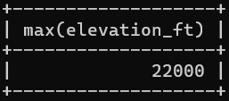
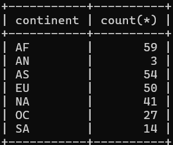
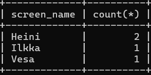
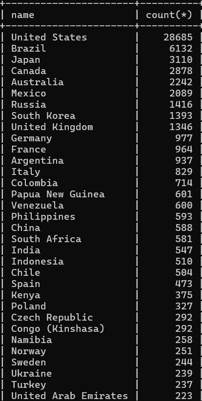
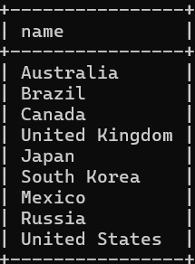
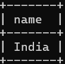
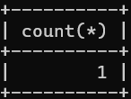
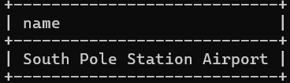

#week 5

###assignment 1
select max(elevation_ft)
from airport;

###assignment 2
select continent, count(*)
from country
group by continent;

###assignment 3
select screen_name, count(*)
from game, goal_reached
where id = game_id
group by screen_name;

###assignment 4
select screen_name
from game
where co2_consumed in(
select min(co2_consumed)
from game
);

###assignment 5
select country.name, count(*)
from airport, country
where airport.iso_country = country.iso_country
group by country.iso_country
order by count(*) desc
limit 50;

###assignment 6
select country.name
from airport, country
where airport.iso_country = country.iso_country
group by country.iso_country
having count(*) > 1000;

###assignment 7
select name
from airport
where elevation_ft in (
select max(elevation_ft)
from airport
);

###assignment 8
select name
from country
where iso_country in (
select iso_country
from airport
where elevation_ft in(
select max(elevation_ft)
from airport
)
);

###assignment 9
select count(*)
from game, goal_reached
where id = game_id and screen_name = "Vesa"
group by screen_name;

###assignment 10
select name
from airport
where latitude_deg in(
select min(latitude_deg)
from airport
);
